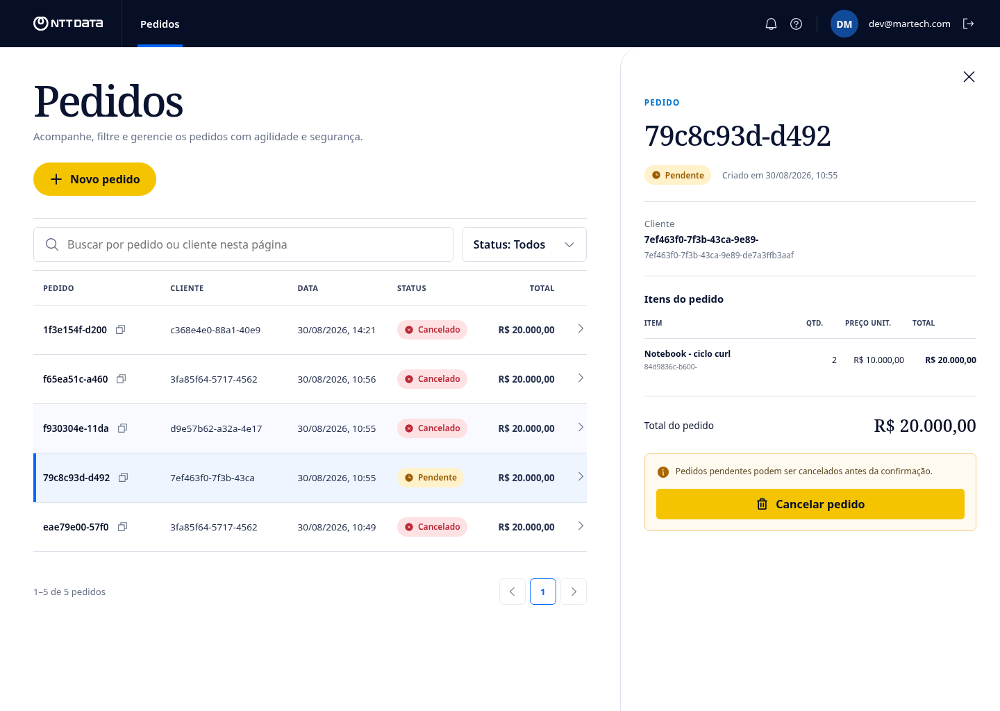

# Order Management

Aplicação de gestão de pedidos desenvolvida para o teste prático de Desenvolvedor .NET Sênior.
O backend em .NET 10 privilegia regras de negócio explícitas, dependências direcionadas ao
domínio, casos de uso isolados e testes automatizados. O frontend React permite avaliar o ciclo
completo por uma interface responsiva inspirada na linguagem visual da NTT DATA.

> **Nota para recrutadores e avaliadores não técnicos:** o frontend é uma camada demonstrativa
> opcional. Ele foi incluído para que seja possível avaliar o produto, as regras de negócio e a
> experiência completa sem depender do Swagger, de comandos `curl` ou de conhecimento sobre .NET.
> O objeto principal do desafio continua sendo o backend; a interface apenas oferece outra porta
> de entrada para a mesma API e não usa dados simulados.

### Avaliação rápida do produto

Quando uma URL temporária de demonstração for compartilhada, basta abri-la e entrar com:

```text
E-mail: dev@martech.com
Senha:  Senha@123
```

O roteiro mais curto para avaliação é:

1. consultar os pedidos e abrir um deles na lateral;
2. criar um pedido com o botão **Novo pedido** — a própria tela pode gerar um UUID de cliente;
3. cancelar o pedido criado e confirmar a mudança de status.

Esse roteiro percorre autenticação JWT, validação, persistência SQLite, cálculo do total, paginação,
consulta e regra de cancelamento. A demonstração pública, quando ativa, é temporária e utiliza
somente dados descartáveis.



O projeto é um monólito modular: existe um único processo e banco de dados, mas API, aplicação,
domínio e infraestrutura possuem responsabilidades e dependências bem definidas. Para este
escopo, isso mantém a operação simples sem impedir uma futura extração de serviços.

> **Aviso:** projeto demonstrativo criado para avaliação técnica. Nome e identidade visual são
> usados apenas como referência do desafio e não representam um produto oficial da NTT DATA.

## Início rápido

### Pré-requisitos

- SDK .NET 10. O `global.json` solicita a versão `10.0.400` e permite avanço dentro da linha
  compatível configurada.
- Node.js 24 e npm, somente para executar o frontend fora do Docker.
- Docker e Docker Compose, somente para a execução em contêiner.

Confirme o SDK antes de começar:

```bash
dotnet --version
dotnet --list-sdks
```

Não execute `dotnet` com `sudo`: o usuário administrador pode resolver outro SDK e também criar
arquivos no projeto com proprietário incorreto.

### Executar localmente

No primeiro terminal, na raiz do repositório, execute a API:

```bash
dotnet restore OrderManagement.slnx
dotnet run --project src/OrderManagement.Api
```

A migration inicial é aplicada automaticamente. O arquivo SQLite local é criado em
`src/OrderManagement.Api/orders.db`.

No segundo terminal, execute o frontend:

```bash
cd frontend
npm ci
npm run dev
```

O Vite abre o frontend em `http://localhost:5173` e encaminha `/auth`, `/api` e `/health` para a
API em `http://localhost:5080`. Por isso o código do navegador usa URLs relativas e não precisa
de configuração adicional para esse cenário.

### Executar com Docker

```bash
docker compose up --build
```

Esse único comando sobe API e frontend. A API executa com usuário não-root e persiste o SQLite
no volume `orders-data`; o Nginx do frontend encaminha as chamadas para o hostname interno `api`.

### URLs

| Recurso | Execução local | Docker Compose |
|---|---|---|
| Frontend | `http://localhost:5173` | `http://localhost:3000` |
| API | `http://localhost:5080` | `http://localhost:8082` |
| Swagger UI | `http://localhost:5080/swagger` | `http://localhost:8082/swagger` |
| OpenAPI JSON | `http://localhost:5080/openapi/v1.json` | `http://localhost:8082/openapi/v1.json` |
| Health check | `http://localhost:5080/health` | `http://localhost:8082/health` |

O arquivo [OrderManagement.Api.http](OrderManagement.Api.http) também contém requisições prontas
para clientes HTTP compatíveis com esse formato.

### Frontend incluído

O diretório [`frontend`](frontend) contém uma aplicação React/Vite que usa a API real, sem mocks.
Ela oferece:

- login com as credenciais fixas do teste e JWT mantido em `sessionStorage`;
- listagem paginada, busca e filtro sobre a página carregada;
- consulta em painel lateral, criação com itens dinâmicos e total previsto;
- confirmação de cancelamento, mensagens de regra de negócio e feedback de sucesso/erro;
- layout responsivo para desktop e mobile;
- proxy de mesma origem em desenvolvimento e no Docker.

O build de produção é servido por Nginx. Não é necessário expor uma variável com o hostname
interno do Compose ao navegador: o frontend chama `/auth` e `/api`, e o proxy resolve o destino.

## Autenticação

Credenciais fixas solicitadas no teste:

```text
E-mail: dev@martech.com
Senha:  Senha@123
```

Faça o login:

```bash
curl --request POST http://localhost:5080/auth/login \
  --header 'Content-Type: application/json' \
  --data '{"email":"dev@martech.com","password":"Senha@123"}'
```

Resposta:

```json
{
  "accessToken": "eyJ...",
  "expiresAt": "2026-08-30T15:00:00Z"
}
```

Envie `accessToken` nas rotas protegidas:

```http
Authorization: Bearer eyJ...
```

No Swagger, execute primeiro `POST /auth/login`, copie somente `accessToken`, clique em
**Authorize** e cole o token. A interface acrescenta o prefixo `Bearer` automaticamente.

## Contrato HTTP

Todas as requisições e respostas JSON usam propriedades em `camelCase`. Enums são enviados como
texto, GUIDs como strings e datas como ISO 8601 em UTC.

| Método | Rota | Auth | Sucesso | Descrição |
|---|---|---:|---:|---|
| `POST` | `/auth/login` | Não | `200` | Emite o JWT |
| `POST` | `/api/orders` | Sim | `201` | Cria um pedido pendente |
| `GET` | `/api/orders?page=1&pageSize=10` | Sim | `200` | Lista pedidos paginados |
| `GET` | `/api/orders/{id}` | Sim | `200` | Consulta um pedido |
| `PATCH` | `/api/orders/{id}/cancel` | Sim | `204` | Cancela um pedido pendente |

Regras relevantes para o consumidor:

- `customerId` deve ser um GUID diferente de zero;
- um pedido precisa conter ao menos um item;
- `productName` é obrigatório e aceita até 200 caracteres;
- `quantity` e `unitPrice` devem ser maiores que zero;
- `page` começa em 1 e `pageSize` aceita valores de 1 a 100;
- apenas pedidos `Pending` podem ser cancelados;
- um segundo cancelamento retorna `409 Conflict`;
- `totalAmount` é calculado pela API e nunca deve ser enviado como entrada.

### Criar um pedido

```bash
curl --request POST http://localhost:5080/api/orders \
  --header 'Authorization: Bearer SEU_TOKEN' \
  --header 'Content-Type: application/json' \
  --data '{
    "customerId": "b9f58fa8-05f2-4bb7-aeb5-d2c549b82857",
    "items": [
      {
        "productName": "Mechanical Keyboard",
        "quantity": 2,
        "unitPrice": 350.50
      }
    ]
  }'
```

A resposta é `201 Created`, contém o pedido completo e expõe a URL do recurso no header
`Location`.

### Listar pedidos

```bash
curl 'http://localhost:5080/api/orders?page=1&pageSize=10' \
  --header 'Authorization: Bearer SEU_TOKEN'
```

Os pedidos são ordenados do mais recente para o mais antigo. Exemplo de resposta:

```json
{
  "items": [],
  "page": 1,
  "pageSize": 10,
  "totalCount": 0,
  "totalPages": 0
}
```

### Consultar e cancelar

```bash
curl http://localhost:5080/api/orders/SEU_ORDER_ID \
  --header 'Authorization: Bearer SEU_TOKEN'

curl --request PATCH http://localhost:5080/api/orders/SEU_ORDER_ID/cancel \
  --header 'Authorization: Bearer SEU_TOKEN'
```

O cancelamento bem-sucedido retorna `204 No Content`. Consulte novamente o pedido para observar
`status: "Cancelled"`.

## Guia de integração para frontend

Esta seção usa TypeScript e `fetch`, mas os contratos valem igualmente para React, Next.js,
Angular, Vue, Svelte ou outro cliente HTTP.

Os exemplos abaixo executam no navegador. Em Next.js ou outro framework com renderização no
servidor, separe o cliente server-side (sem `sessionStorage`) ou adote um BFF.

### 1. Configure a URL base

Para outro frontend Vite que chame a API diretamente, crie a variável:

```dotenv
VITE_API_BASE_URL=http://localhost:5080
```

No código:

```ts
export const API_URL =
  import.meta.env.VITE_API_BASE_URL ?? "http://localhost:5080";
```

Com Docker, uma aplicação externa deve usar `http://localhost:8082`. O frontend incluído não usa
essa variável: ele faz chamadas relativas e o Nginx encaminha para `http://api:8080`. Não coloque
o hostname interno `api` no código executado pelo navegador; esse nome só é resolvido entre os
contêineres.

### 2. CORS

A API aceita chamadas diretas das origens locais mais comuns:

- `http://localhost:3000`;
- `http://localhost:4200`;
- `http://localhost:5173`;
- as mesmas portas usando `127.0.0.1`.

Para outra origem, configure `Cors:AllowedOrigins`. Exemplo em variável de ambiente:

```bash
Cors__AllowedOrigins__0=https://app.exemplo.com \
dotnet run --project src/OrderManagement.Api
```

As origens não configuradas permanecem bloqueadas. Como a autenticação usa Bearer e não cookie,
o frontend não deve definir `credentials: "include"`. Em desenvolvimento também é possível usar
o proxy do próprio framework frontend e manter chamadas relativas como `/api/orders`.

### 3. Declare os tipos

```ts
export type OrderStatus = "Pending" | "Confirmed" | "Cancelled";

export interface LoginResponse {
  accessToken: string;
  expiresAt: string;
}

export interface CreateOrderItemInput {
  productName: string;
  quantity: number;
  unitPrice: number;
}

export interface CreateOrderInput {
  customerId: string;
  items: CreateOrderItemInput[];
}

export interface OrderItem {
  id: string;
  productName: string;
  quantity: number;
  unitPrice: number;
  totalAmount: number;
}

export interface Order {
  id: string;
  customerId: string;
  status: OrderStatus;
  createdAt: string;
  totalAmount: number;
  items: OrderItem[];
}

export interface PagedResult<T> {
  items: T[];
  page: number;
  pageSize: number;
  totalCount: number;
  totalPages: number;
}

export interface ProblemDetails {
  type?: string;
  title: string;
  status: number;
  detail?: string;
  instance?: string;
  errors?: Record<string, string[]>;
}
```

### 4. Centralize o cliente HTTP

O cliente abaixo adiciona o JWT, trata respostas sem corpo e converte erros no formato
`ProblemDetails` da API:

```ts
import { API_URL } from "./config";
import type { ProblemDetails } from "./contracts";

export class ApiError extends Error {
  constructor(public readonly problem: ProblemDetails) {
    super(problem.detail ?? problem.title);
  }
}

export async function api<T>(
  path: string,
  init: RequestInit = {},
): Promise<T> {
  const headers = new Headers(init.headers);
  const token = sessionStorage.getItem("accessToken");

  headers.set("Accept", "application/json");
  if (init.body) headers.set("Content-Type", "application/json");
  if (token) headers.set("Authorization", `Bearer ${token}`);

  const response = await fetch(`${API_URL}${path}`, { ...init, headers });

  if (!response.ok) {
    const problem = (await response.json().catch(() => ({
      title: "Falha de comunicação com a API",
      status: response.status,
    }))) as ProblemDetails;

    if (response.status === 401) {
      sessionStorage.removeItem("accessToken");
      sessionStorage.removeItem("tokenExpiresAt");
    }

    throw new ApiError(problem);
  }

  if (response.status === 204) return undefined as T;
  return response.json() as Promise<T>;
}
```

`sessionStorage` foi usado apenas para tornar o exemplo completo. Em uma aplicação pública,
avalie o modelo de ameaça: tokens acessíveis ao JavaScript exigem forte prevenção contra XSS;
um BFF com cookie `HttpOnly`, `Secure` e proteção CSRF pode ser preferível.

### 5. Implemente login e expiração

```ts
import { api } from "./api";
import type { LoginResponse } from "./contracts";

export async function login(email: string, password: string): Promise<void> {
  const auth = await api<LoginResponse>("/auth/login", {
    method: "POST",
    body: JSON.stringify({ email, password }),
  });

  sessionStorage.setItem("accessToken", auth.accessToken);
  sessionStorage.setItem("tokenExpiresAt", auth.expiresAt);
}

export function hasValidSession(): boolean {
  const token = sessionStorage.getItem("accessToken");
  const expiresAt = sessionStorage.getItem("tokenExpiresAt");
  return Boolean(token && expiresAt && Date.parse(expiresAt) > Date.now());
}

export function logout(): void {
  sessionStorage.removeItem("accessToken");
  sessionStorage.removeItem("tokenExpiresAt");
}
```

Um `401` pode significar credenciais inválidas no login ou token ausente, inválido ou expirado nas
rotas de pedidos. O frontend deve limpar a sessão e redirecionar ao login quando uma chamada
protegida retornar esse status.

### 6. Implemente as operações de pedidos

```ts
import { api } from "./api";
import type { CreateOrderInput, Order, PagedResult } from "./contracts";

export function createOrder(input: CreateOrderInput): Promise<Order> {
  return api<Order>("/api/orders", {
    method: "POST",
    body: JSON.stringify(input),
  });
}

export function listOrders(page = 1, pageSize = 10): Promise<PagedResult<Order>> {
  const query = new URLSearchParams({
    page: String(page),
    pageSize: String(pageSize),
  });

  return api<PagedResult<Order>>(`/api/orders?${query}`);
}

export function getOrder(id: string): Promise<Order> {
  return api<Order>(`/api/orders/${encodeURIComponent(id)}`);
}

export function cancelOrder(id: string): Promise<void> {
  return api<void>(`/api/orders/${encodeURIComponent(id)}/cancel`, {
    method: "PATCH",
  });
}
```

Depois de criar ou cancelar, atualize o cache ou estado local. Com TanStack Query, SWR ou solução
equivalente, invalide tanto a chave da listagem quanto a chave do pedido afetado.

### 7. Trate erros por status

| Status | Significado | Comportamento sugerido no frontend |
|---:|---|---|
| `400` | Entrada inválida | Exibir `errors` junto aos campos correspondentes |
| `401` | Login inválido ou sessão expirada | Limpar sessão e solicitar autenticação |
| `404` | Pedido não encontrado | Informar que o recurso não existe ou foi removido |
| `409` | Regra de negócio violada | Atualizar o pedido e mostrar `detail` ao usuário |
| `500` | Falha inesperada | Exibir mensagem genérica e permitir nova tentativa |

Exemplo de validação:

```json
{
  "title": "Validation failed",
  "status": 400,
  "errors": {
    "Items[0].Quantity": [
      "'Quantity' must be greater than '0'."
    ]
  }
}
```

As chaves de `errors` refletem os nomes das propriedades validadas, como `CustomerId`, `Items`,
`Items[0].ProductName`, `Page` e `PageSize`. O frontend pode manter um pequeno mapeamento dessas
chaves para os nomes dos campos do formulário.

### 8. Cuidados de apresentação

- Converta `createdAt` somente para exibição; o valor recebido está em UTC.
- Use `Intl.DateTimeFormat` para datas e `Intl.NumberFormat` para moeda.
- Considere `totalAmount` retornado pela API como a fonte de verdade.
- Desabilite o botão de cancelar quando `status !== "Pending"`.
- Ainda trate `409`, pois o estado pode mudar entre a consulta e o clique.
- Não decodifique o JWT como fonte de autorização; uma interface pode ler claims para conveniência,
  mas a API continua sendo a autoridade.

Exemplo de moeda:

```ts
const formatCurrency = new Intl.NumberFormat("pt-BR", {
  style: "currency",
  currency: "BRL",
});

formatCurrency.format(order.totalAmount);
```

O domínio do teste não possui o campo `currency`; `BRL` acima é apenas uma decisão de apresentação
do exemplo. Um produto real deveria transportar moeda explicitamente.

## Arquitetura

```text
API ──────────────► Application ──► Domain
 │                       ▲
 └──► Infrastructure ────┘
             │
             └────────────────────► Domain
```

```text
src/
├── OrderManagement.Domain          # Agregado, entidades e regras de negócio
├── OrderManagement.Application     # Commands, queries, handlers, validators e abstrações
├── OrderManagement.Infrastructure  # EF Core, SQLite, JWT, repositório e migrations
└── OrderManagement.Api             # HTTP, autenticação, CORS e composition root

frontend/
├── src                              # React, cliente HTTP e componentes da jornada de pedidos
├── public/assets                    # Logo oficial armazenado localmente
├── Dockerfile                       # Build Node e runtime Nginx
└── nginx.conf                       # SPA e proxy reverso para a API

tests/
├── OrderManagement.UnitTests       # Domínio, handlers, validators e behaviors
└── OrderManagement.IntegrationTests# Pipeline HTTP real com SQLite isolado
```

### Por que Minimal APIs

O escopo possui poucos endpoints e eles apenas convertem contratos HTTP em commands/queries e
formatam respostas. Minimal APIs reduzem cerimônia sem mover lógica para a camada web. Se políticas
HTTP, filtros, versionamentos ou grupos de controllers crescerem significativamente, Controllers
podem ser introduzidos sem alterar Application ou Domain.

### Por que monólito modular

Pedidos formam o único contexto de negócio deste teste. Microserviços adicionariam comunicação
distribuída, consistência eventual, observabilidade e custo operacional sem resolver uma necessidade
atual. A separação interna já cria limites que podem orientar uma extração futura quando houver
escala independente, autonomia de equipes ou ciclos de deploy diferentes.

### Domínio e persistência

`Order` é a raiz do agregado e controla criação, itens, cálculo do total e transições de status.
As invariantes permanecem no domínio mesmo quando o FluentValidation já rejeitou uma entrada, pois
o domínio não pode depender de toda chamada ter origem HTTP.

A Application depende de `IOrderRepository`, específico para o agregado. Um repositório genérico
esconderia intenções e consultas sem trazer benefício neste escopo. Queries usam `AsNoTracking`;
commands carregam o agregado com tracking para persistir mudanças.

`TotalAmount` é derivado de `UnitPrice * Quantity` e não é persistido, evitando duas fontes de
verdade. O uso de `decimal` evita os erros binários típicos de `double` em valores monetários.

### CQRS e MediatR

Commands representam intenção de alteração; queries representam leitura. Cada caso de uso possui
um handler pequeno. O MediatR desacopla os endpoints desses handlers e permite aplicar validação e
logging de maneira uniforme no pipeline. O custo é uma camada adicional de indireção, aceitável
aqui porque ambos os behaviors são requisitos ou desejáveis do teste.

### Validação e erros

FluentValidation protege o contrato de entrada antes do handler. O domínio protege invariantes de
negócio. O handler global traduz exceções conhecidas para `ProblemDetails`:

- `400` para entrada inválida;
- `401` para credenciais ou autenticação inválidas;
- `404` para pedido inexistente;
- `409` para violação de regra de negócio;
- `500` para erro inesperado, sem detalhes internos.

Quando o JWT está ausente ou inválido, o próprio middleware Bearer pode retornar `401` sem corpo;
por isso o exemplo de cliente frontend também possui fallback para respostas que não sejam JSON.

## Testes

```bash
dotnet test OrderManagement.slnx
```

A suíte possui 41 testes unitários para handlers, validators, behaviors e domínio, além de 8 testes
de integração para Swagger, CORS, autenticação, validações, erros e o ciclo de pedidos. A cobertura
unitária de Application e Domain é de aproximadamente 95% das linhas e 100% dos branches.

O frontend também valida o build e o empacotamento estático:

```bash
cd frontend
npm run build
npm run test:sites
```

São 4 testes do worker de hospedagem, cobrindo arquivos estáticos, fallback da SPA, isolamento de
rotas de API e artefatos obrigatórios. A jornada visual foi verificada em desktop e mobile; o
relatório está em [`frontend/design-qa.md`](frontend/design-qa.md).

Para gerar cobertura em formato Cobertura:

```bash
dotnet test OrderManagement.slnx \
  --collect:"XPlat Code Coverage" \
  -- DataCollectionRunSettings.DataCollectors.DataCollector.Configuration.Format=cobertura
```

Os testes de handlers usam fakes pequenos em vez de um framework de mocks. Os testes de integração
usam `WebApplicationFactory` e um arquivo SQLite exclusivo por fixture, preservando o comportamento
real do provedor sem compartilhar o banco da aplicação.

## Logging e observabilidade

O `LoggingBehavior` registra request, response e duração de commands e queries. Login implementa
uma marcação sensível, portanto senha e token são omitidos. Serilog também registra o ciclo HTTP.

OpenTelemetry instrumenta requisições ASP.NET Core e exporta traces para o console. Em produção, o
exporter seria substituído por OTLP e enviado a um Collector ou plataforma de observabilidade.

## Migrations

A migration `InitialCreate` está versionada e `Database.MigrateAsync` aplica migrations pendentes
durante a inicialização, como solicitado no teste.

Para criar outra migration:

```bash
dotnet tool install --global dotnet-ef --version 10.0.11
dotnet ef migrations add NomeDaMigration \
  --project src/OrderManagement.Infrastructure \
  --startup-project src/OrderManagement.Api
```

Em produção com múltiplas réplicas, migrations seriam executadas por uma etapa única de deploy, e
não concorrentemente por cada instância.

## Configuração

| Chave | Finalidade | Padrão local |
|---|---|---|
| `ConnectionStrings:OrdersDb` | Arquivo SQLite | `Data Source=orders.db` |
| `Jwt:Issuer` | Emissor aceito | `OrderManagement.Api` |
| `Jwt:Audience` | Audiência aceita | `OrderManagement.Client` |
| `Jwt:Key` | Chave HMAC | Apenas desenvolvimento |
| `Jwt:ExpirationMinutes` | Duração do token | `60` |
| `Cors:AllowedOrigins` | Frontends autorizados pelo navegador | Portas locais documentadas |

Variáveis de ambiente usam `__` como separador. Exemplos:

```bash
ConnectionStrings__OrdersDb='Data Source=/data/orders.db'
Jwt__Key='uma-chave-segura-com-pelo-menos-32-caracteres'
Cors__AllowedOrigins__0='https://app.exemplo.com'
```

As chaves versionadas são exclusivas para desenvolvimento e avaliação.

## SonarQube

O serviço fica em um profile opcional para não consumir recursos no uso normal:

```bash
docker compose --profile quality up sonarqube
```

Após a inicialização, acesse `http://localhost:9000`.

## Checklist do teste

| Requisito | Implementação |
|---|---|
| .NET 10 | `TargetFramework` centralizado em `net10.0` |
| Clean Architecture | Domain, Application, Infrastructure e API separadas |
| CQRS + MediatR | Commands e queries com handlers por caso de uso |
| EF Core + SQLite | Configurações por entidade e migration versionada |
| Migration automática | `Database.MigrateAsync` no startup |
| JWT | Login fixo e grupo `/api/orders` protegido |
| FluentValidation | `ValidationBehavior` no pipeline do MediatR |
| xUnit | Todos os handlers e regras centrais cobertos |
| Docker | API e frontend multi-stage, Nginx, execução não-root e volume SQLite |
| Frontend | React responsivo integrado à API real e disponível na porta `3000` pelo Compose |
| README | Execução local, Docker, arquitetura e integração frontend |
| Serilog | Request, response e duração com dados sensíveis omitidos |
| Integração | `WebApplicationFactory` com SQLite isolado |
| SonarQube | Serviço opcional no profile `quality` |
| OpenTelemetry | Traces do ASP.NET Core no console |

## O que mudaria em produção

- PostgreSQL ou outro banco servidor no lugar do SQLite;
- provedor de identidade, hash de senha, refresh token e revogação no lugar do usuário fixo;
- secrets em cofre e rotação de chaves;
- HTTPS obrigatório, Swagger restrito e CORS apenas para domínios oficiais;
- rate limiting, auditoria, métricas, alertas e tracing via OTLP;
- concorrência otimista para impedir transições simultâneas conflitantes;
- idempotency key na criação e definição explícita da semântica de repetição do cancelamento;
- moeda e política de arredondamento representadas no domínio;
- migrations em etapa exclusiva do deploy;
- paginação por cursor e índices orientados ao padrão real de consulta;
- eventos de domínio e outbox quando existirem integrações externas confiáveis.

Microserviços só seriam adotados diante de uma necessidade concreta de escala, autonomia de equipe
ou isolamento operacional. O limite do agregado já existente fornece um ponto inicial para essa
evolução sem pagar antecipadamente o custo de um sistema distribuído.
